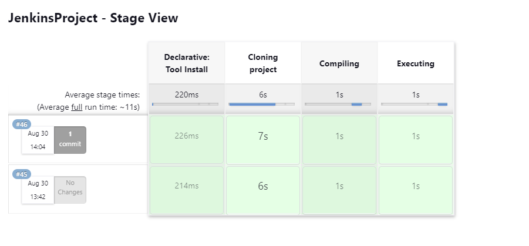

# CI and CD Project
CI &amp; CD Practice, Jenkins

# How to run ?
## Jenkins
1. Make sure you have jenkins installed.
2. Once you have installed jenkins, open it in your localhost.
3. Go to dashboard > manage jenkins > tools.
4. Go to `JDK installations` section.
5. Add JDK, and install JDK20, make sure that the name must be `JDK20`.
6. Once you have JDK20 installed for Java, go to dashboard again.
7. Go to New Item.
8. Enter the name project and select `Pipeline` project.
9. Click on ok.
10. Once you are configuring the project, click on `This project is parametized`.
11. Click on `String parameter`, as a name, enter `MY_NAME`, you can enter the default value that you want.
12. Type the follwing in pipeline script:

13. Click on `Save`.
14. Click on `Build with parameters option`.
15. Click on `Build`.

Evidence:

Stage Views:

Logs:

First change:

Second change:

